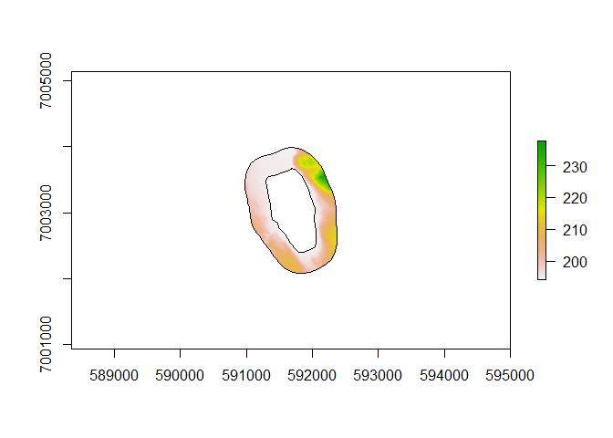

# Load up the required libraries

``` r
library(lakemorpho)
library(raster)
```

    ## Loading required package: sp

``` r
library(sp)
library(rgdal)
```

    ## rgdal: version: 1.4-7, (SVN revision 845)
    ##  Geospatial Data Abstraction Library extensions to R successfully loaded
    ##  Loaded GDAL runtime: GDAL 2.2.3, released 2017/11/20
    ##  Path to GDAL shared files: C:/Program Files/R/R-3.6.1/library/rgdal/gdal
    ##  GDAL binary built with GEOS: TRUE 
    ##  Loaded PROJ.4 runtime: Rel. 4.9.3, 15 August 2016, [PJ_VERSION: 493]
    ##  Path to PROJ.4 shared files: C:/Program Files/R/R-3.6.1/library/rgdal/proj
    ##  Linking to sp version: 1.3-1

``` r
library(gdalUtils)
library(rgeos)
```

    ## rgeos version: 0.5-2, (SVN revision 621)
    ##  GEOS runtime version: 3.6.1-CAPI-1.10.1 
    ##  Linking to sp version: 1.3-1 
    ##  Polygon checking: TRUE

# Read in vector files

``` r
tst_1lakes <- readOGR("example_data", "tst_1lakes")
```

    ## OGR data source with driver: ESRI Shapefile 
    ## Source: "C:\Users\JHollist\OneDrive - Environmental Protection Agency (EPA)\projects\lakemorpho_help\viktor\example_data", layer: "tst_1lakes"
    ## with 1 features
    ## It has 2 fields
    ## Integer64 fields read as strings:  TARGET_FID

# Read in DEM

The ESRI raster needs to be converted to something the Raster package
can handle. Here I am using `gdalUtilities::gdal_translate` to convert
to a tif

``` r
gdal_translate("example_data/tst_dem3k/", "example_data/tst_dem3k.tif")
```

    ## NULL

``` r
tst_dem <- raster("example_data/tst_dem3k.tif")
```

# Crop DEM to extent of lake buffer

This step isn’t documented yet, but if you do this for each of your
lakes, it should:

1.  Speed up creation of the lakemorphometry object
2.  Speed up the calculation of the metrics.
3.  And, most importantly, fix the NA return on the maximum depth (at
    least it did for you 1 lake example). At this time I am not sure why
    the cropped DEM with the larger extent is returning NA. Need to dig
    into that.

These steps estimate a reasonable buffer distance (using the
lakeMajorAxisLength function), buffer the lake with that distance, then
crop the DEM to the extent of the buffered lake.

``` r
tst_1majorlength <- lakeMajorAxisLength(lakeMorphoClass(tst_1lakes), F)
tst_1buffer <- gBuffer(tst_1lakes, width = tst_1majorlength)
tst_1dem <- crop(tst_dem, tst_1buffer)
```

# Create and plot the lakemorpho object

Now we can create the `lakemorpho` object with the lakes and the cropped
DEM.

``` r
tst_1lm <- lakeSurroundTopo(tst_1lakes, tst_1dem)
plot(tst_1lm)
```

<!-- -->

# Calculate the metrics

Lastly, we can calculate the volume:

``` r
tst_1volume <- lakeVolume(tst_1lm)
tst_1volume
```

    ## [1] 3617734

Don’t use the `calcLakeMetrics` function for this. There is a bug in how
it is doing lakeVolume. I know what it is but haven’t yet fixed it.
